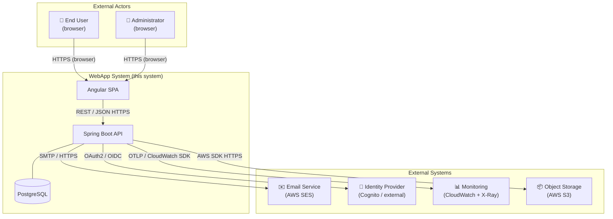
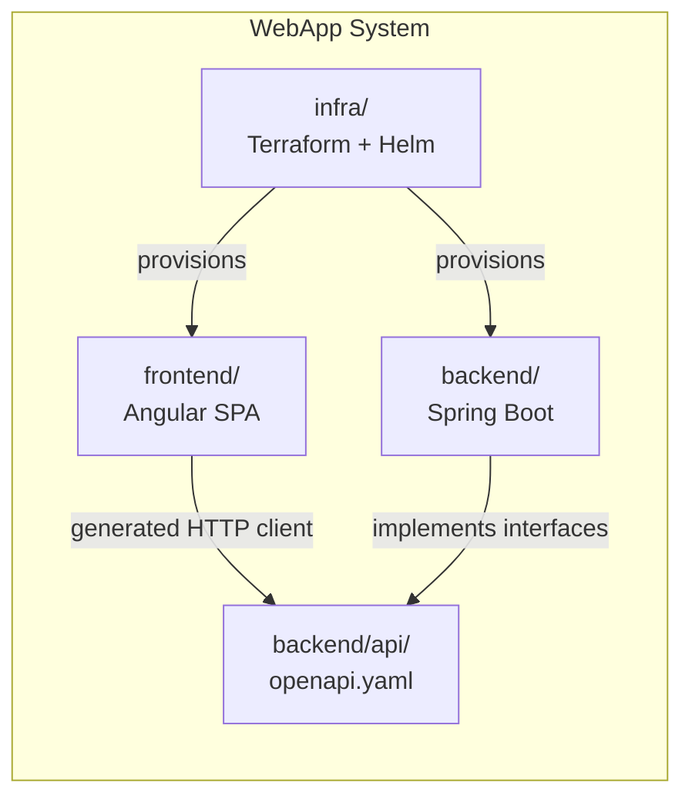
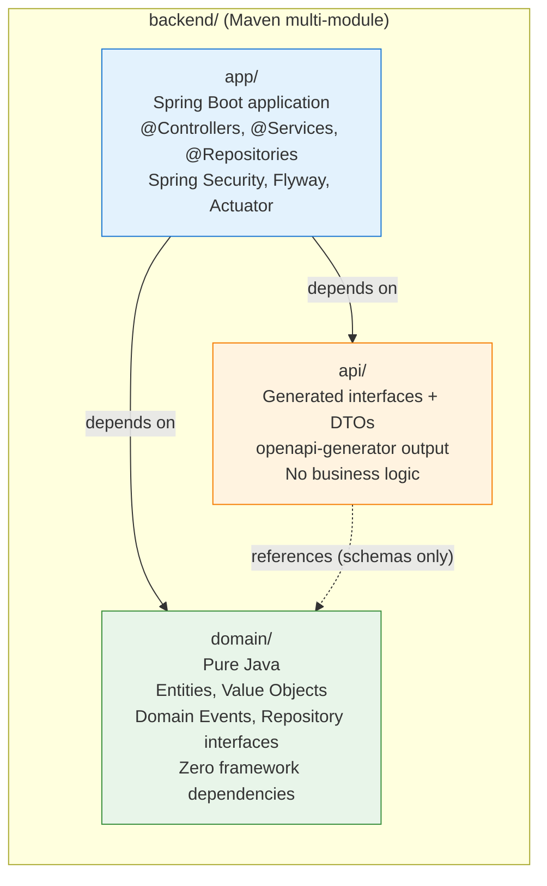
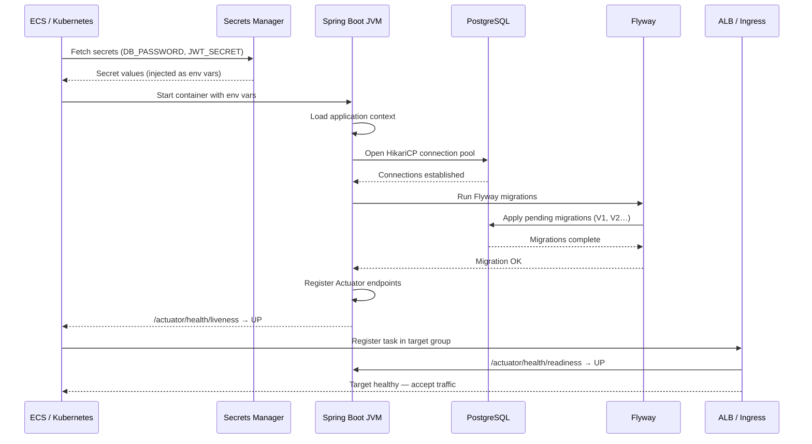
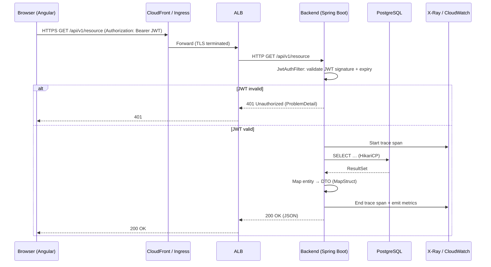
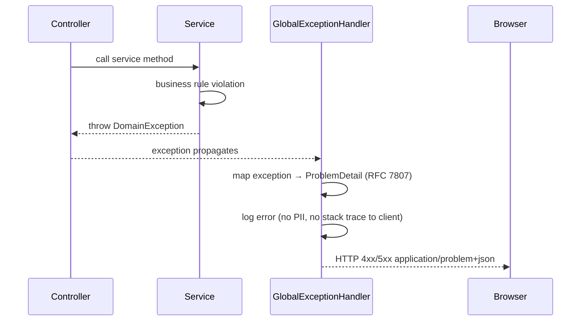
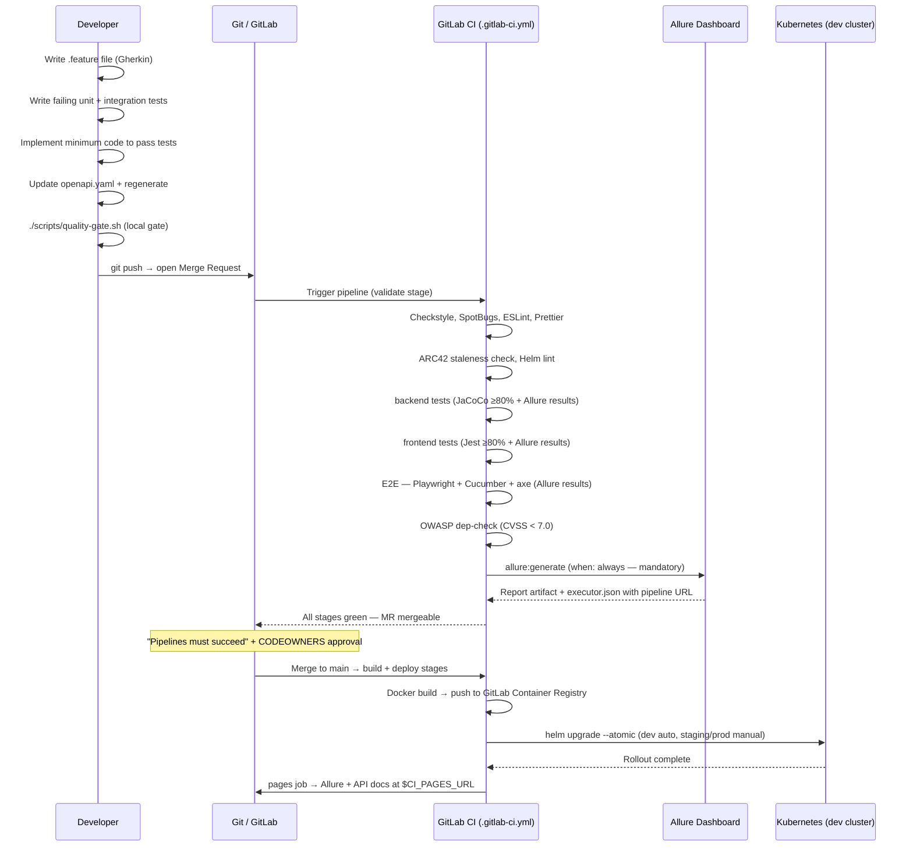
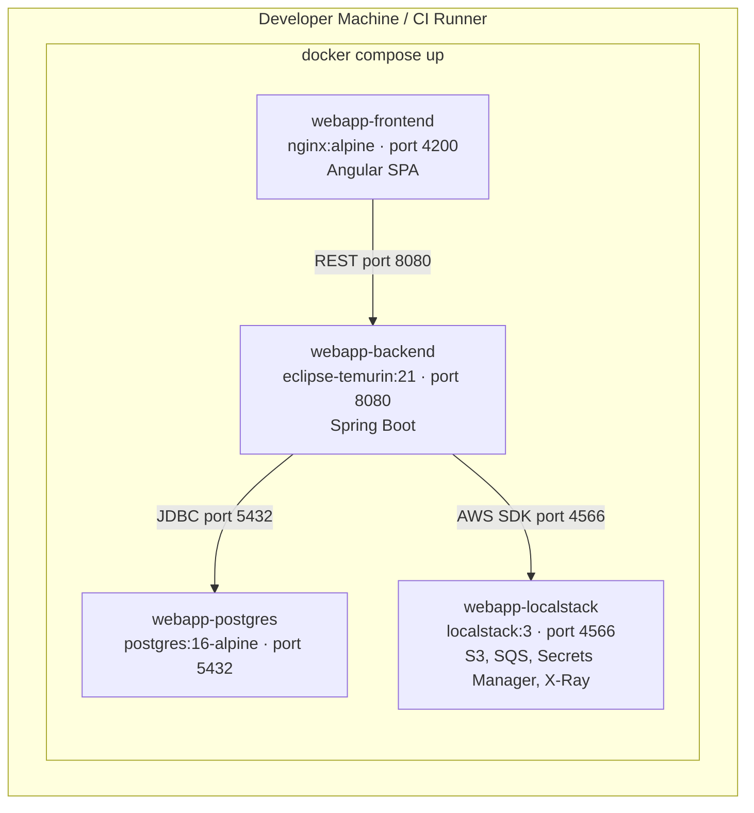
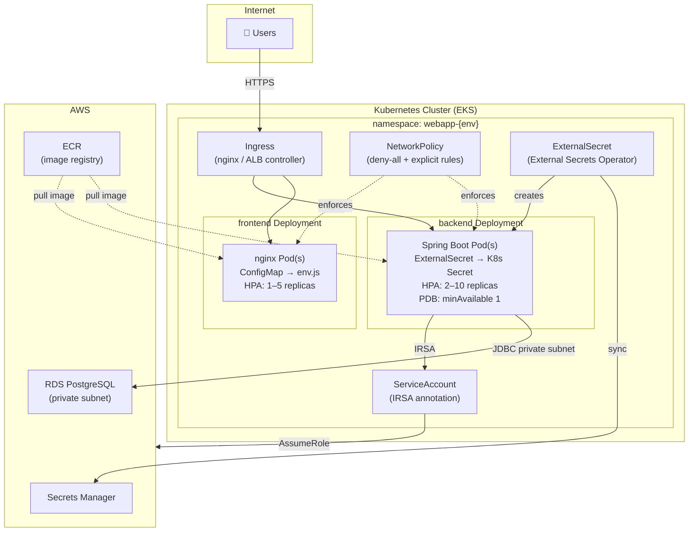
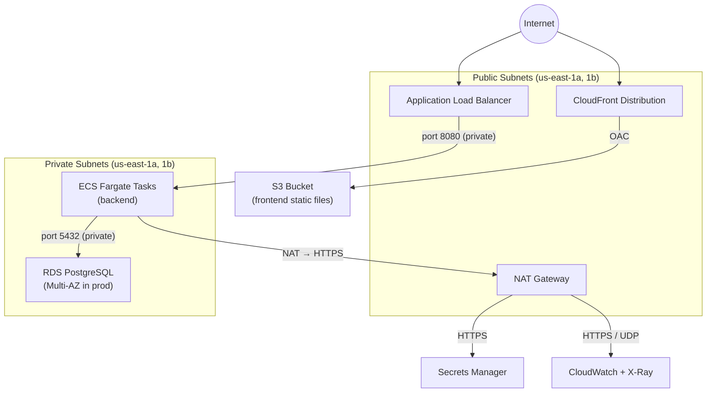

# Solution Architecture — ARC42

<!--
  WHY THIS FILE EXISTS: Single authoritative source for the solution architecture,
  structured according to the ARC42 template (https://arc42.org).

  MAINTENANCE CONTRACT (Claude Code must enforce this):
  ─────────────────────────────────────────────────────
  This document is a living artifact. It must be updated in the SAME PR as the
  code change that invalidates it. The following events always require an update:

  | Event                                        | Section(s) to update          |
  |----------------------------------------------|-------------------------------|
  | New bounded context or feature module added  | 4, 5.2, 6, 8                  |
  | New external system integrated               | 3, 5.1, 6                     |
  | New infrastructure component added           | 7, 10                         |
  | New cross-cutting concern introduced         | 8                             |
  | Architecture Decision Record added           | 9                             |
  | New quality requirement or SLA defined       | 10                            |
  | Known risk identified or resolved            | 11                            |
  | New term introduced in the codebase          | 12                            |
  | Spring profile, port, or URL changed         | 3, 7                          |
  | Deployment target changed (K8s namespace…)   | 7                             |

  Claude Code rule: before closing a PR that changes architecture, run:
    grep -r "ARCHITECTURE-STALE" docs/ARC42.md
  If the grep returns hits, update the flagged section before merging.

  To flag a section that needs review after a change, add a comment:
    <!-- ARCHITECTURE-STALE: reason -->
  Claude Code will detect it during PR review and update the section.
-->

> **Version:** 0.0.2 · **Status:** Current · **Last updated:** 2026-05-31
> **Owned by:** Platform Team · **Review cycle:** Every sprint or on architectural change

---

## Table of Contents

| # | Section | Purpose |
|---|---------|---------|
| 1 | [Introduction and Goals](#1-introduction-and-goals) | Business drivers, top quality goals, stakeholders |
| 2 | [Architecture Constraints](#2-architecture-constraints) | Technical, organisational, and regulatory constraints |
| 3 | [System Scope and Context](#3-system-scope-and-context) | What is inside and outside the system |
| 4 | [Solution Strategy](#4-solution-strategy) | Key technology decisions and architectural patterns |
| 5 | [Building Block View](#5-building-block-view) | Static decomposition into modules and components |
| 6 | [Runtime View](#6-runtime-view) | Dynamic behaviour — key scenarios and sequence flows |
| 7 | [Deployment View](#7-deployment-view) | Infrastructure, environments, and deployment artifacts |
| 8 | [Crosscutting Concepts](#8-crosscutting-concepts) | Patterns and solutions applied across all building blocks |
| 9 | [Architecture Decisions](#9-architecture-decisions) | Index of all ADRs with rationale summary |
| 10 | [Quality Requirements](#10-quality-requirements) | Quality tree and concrete quality scenarios |
| 11 | [Risks and Technical Debt](#11-risks-and-technical-debt) | Known risks and accepted shortcuts |
| 12 | [Glossary](#12-glossary) | Domain and technical terms used in this document |

---

## 1. Introduction and Goals

### 1.1 Purpose

> **Replace this paragraph** with one paragraph describing what the application does and who
> it serves. Until then: this repository is a production-grade scaffold — all sections contain
> architectural decisions made at scaffold time that remain valid for every application built
> on top of it.

### 1.2 Business Requirements (Top 3)

| ID | Requirement | Source |
|----|-------------|--------|
| BR-01 | [Replace: primary business capability the system must deliver] | [Stakeholder] |
| BR-02 | [Replace: second most important business requirement] | [Stakeholder] |
| BR-03 | [Replace: third business requirement] | [Stakeholder] |

### 1.3 Quality Goals

The top five quality goals that shape every architectural decision, in priority order.
Resolving a conflict between two goals follows this priority ranking.

| Priority | Quality Goal | Scenario |
|----------|-------------|---------|
| 1 | **Correctness** | Every user action either succeeds or returns an actionable error. No silent data corruption. |
| 2 | **Accessibility** | Any user, regardless of assistive technology, can complete every user-facing workflow. WCAG 2.1 AA. |
| 3 | **Security** | No sensitive data is exposed in logs, error responses, or URLs. All endpoints are authenticated by default. |
| 4 | **Maintainability** | A new developer can understand, test, and change any feature area without prior system knowledge. |
| 5 | **Deployability** | Every merge to `main` produces a deployable artifact within 15 minutes. Rollback takes under 5 minutes. |

### 1.4 Stakeholders

| Role | Name / Group | Expectations |
|------|-------------|-------------|
| Product Owner | [Name] | Understands feature scope, accepts quality trade-offs |
| Platform Team | [Names] | Owns architecture, CI/CD, and infrastructure |
| Development Team | [Names] | Extends features within established standards |
| Security Team | [Name] | Reviews security controls, approves OWASP suppressions |
| Operations | [Name / Team] | Monitors system health, handles on-call incidents |
| End Users | [Description] | Uses the application; expects accessible, fast, correct behaviour |

---

## 2. Architecture Constraints

### 2.1 Technical Constraints

| ID | Constraint | Rationale |
|----|-----------|-----------|
| TC-01 | Java 21 LTS for backend | Organisation Java standard; LTS until 2029 |
| TC-02 | Angular 18+ for frontend | Align with organisation frontend guild |
| TC-03 | AWS as cloud provider | Existing contracts, tooling, and team expertise |
| TC-04 | PostgreSQL 16 as primary database | ACID compliance; AWS RDS managed offering |
| TC-05 | All infrastructure as Terraform code | No click-ops; reproducibility and audit trail required |
| TC-06 | Docker as container runtime | Standard OCI container; compatible with ECS Fargate and EKS |
| TC-07 | GitLab as VCS, CI/CD, and container registry platform | Organisation standard; integrated registry, Pages, CODEOWNERS, and environment tracking (ADR-0005) |
| TC-08 | OpenAPI 3.1 contract-first | Required to support parallel frontend/backend development |

### 2.2 Organisational Constraints

| ID | Constraint | Rationale |
|----|-----------|-----------|
| OC-01 | All changes via Merge Request + mandatory CI pipeline | No direct commits to `main`; pipeline must pass + Code Owner approval required; enforced by GitLab protected branch rules |
| OC-02 | Architectural decisions recorded as ADRs | Organisational memory; onboarding requirement |
| OC-03 | WCAG 2.1 AA for all user-facing features | Legal obligation in target markets |
| OC-04 | OWASP dependency scan on every build | Security policy; CVEs ≥ 7.0 block release |
| OC-05 | Secrets never in source code | Security policy; enforced by pre-commit hooks |

### 2.3 Regulatory / Compliance Constraints

| ID | Constraint | Applicable to |
|----|-----------|--------------|
| RC-01 | WCAG 2.1 AA accessibility | All user-facing UI (ADA / EN 301 549) |
| RC-02 | No PII in logs | All log output (GDPR / local data regulations) |
| RC-03 | Data encryption at rest and in transit | RDS, S3, all network traffic (TLS 1.2+) |
| RC-04 | [Add applicable regulation] | [Scope] |

---

## 3. System Scope and Context

### 3.1 Business Context

What is **inside** the system boundary (this application) and what is **outside** (external actors and systems it communicates with).



### 3.2 Technical Context

Communication channels and protocols between the system and its neighbours.

| Interface | Protocol | Direction | Format | Authentication |
|-----------|----------|-----------|--------|---------------|
| Browser → CloudFront | HTTPS/TLS 1.2+ | Inbound | HTTP/1.1 or HTTP/2 | None (public) / JWT (API) |
| CloudFront → S3 | S3 protocol (OAC) | Internal | Binary | IAM (Origin Access Control) |
| ALB → Backend | HTTP (private VPC) | Internal | HTTP/1.1 | TLS terminated at ALB |
| Backend → PostgreSQL | JDBC/TCP | Outbound | PostgreSQL wire | Username + password (Secrets Manager) |
| Backend → AWS SES | HTTPS | Outbound | AWS SDK | IAM Task Role (IRSA) |
| Backend → Secrets Manager | HTTPS | Outbound | AWS SDK | IAM Task Role (IRSA) |
| Backend → CloudWatch / X-Ray | HTTPS / UDP | Outbound | OTLP / X-Ray SDK | IAM Task Role (IRSA) |
| Backend → Identity Provider | HTTPS | Outbound | OAuth2 / OIDC | Client credentials / PKCE |

### 3.3 Ports and Endpoints

| Component | Port | Protocol | Environment |
|-----------|------|----------|-------------|
| Backend (local) | `8080` | HTTP | local, CI |
| Frontend dev server | `4200` | HTTP | local |
| Frontend nginx | `80` | HTTP | Docker, Kubernetes |
| PostgreSQL | `5432` | TCP | all |
| LocalStack | `4566` | HTTP | local |
| Backend actuator/health | `8080/actuator/health` | HTTP | all |

---

## 4. Solution Strategy

### 4.1 Core Architectural Patterns

| Pattern | Applied where | Why |
|---------|--------------|-----|
| **Hexagonal Architecture** (Ports & Adapters) | Backend module structure | Keeps domain logic framework-free; testable in isolation; enables swapping infrastructure without touching business rules |
| **Contract-First API** | `backend/api/openapi.yaml` | Single source of truth; enables parallel frontend/backend development; generated clients always match the spec |
| **Three-Layer Test Pyramid** | All test suites | Fast unit tests catch regressions early; Testcontainers integration tests verify real DB behaviour; Cucumber E2E tests verify business scenarios |
| **Accessibility-by-default** | All Angular components | `jest-axe` in every unit test; `@axe-core/playwright` in every E2E test; accessibility is never retrofitted |
| **12-Factor App** | Backend configuration | Config via env vars; stateless; logs to stdout; disposable processes |
| **GitOps** | Helm chart + GitLab CI | Cluster state is the rendered Helm chart; GitLab CI (`deploy` stage) is the only actor that applies it; no manual `kubectl apply` in production |
| **Runtime environment injection** | `window.__env` / Helm ConfigMap | One Docker image runs in all environments; API URL injected at container start, not build time |

### 4.2 Key Technology Decisions

| Decision | Choice | Alternative considered | Reason for choice |
|----------|--------|----------------------|-------------------|
| Backend language | Java 21 | Go, Node.js | Virtual threads; LTS until 2029; team expertise |
| Frontend framework | Angular 18 | React, Vue | Strong TypeScript; built-in DI; enterprise maturity |
| UI component library | PrimeNG + PrimeFlex | Material, Ant Design | Angular-native; WCAG-aware; comprehensive components |
| Database | PostgreSQL 16 | MySQL, MongoDB | ACID; JSON support; managed RDS; rich ecosystem |
| Secret management | AWS Secrets Manager | SSM Parameter Store, Vault | Auto-rotation; ExternalSecret Operator integration; fine-grained IAM |
| Container orchestration | ECS Fargate + Helm/EKS | EKS-only, Lambda | Fargate for simplicity; Helm chart for K8s parity |
| IaC | Terraform | AWS CDK, Pulumi | Multi-cloud portable; large module ecosystem |
| CI/CD platform | GitLab CI/CD | GitHub Actions | Integrated registry, Pages, CODEOWNERS, Environments (ADR-0005) |
| Test dashboard | Allure Framework | ReportPortal, JUnit XML | Unified multi-layer dashboard; no separate server needed; `when: always` ensures report on every pipeline run (ADR-0006) |

---

## 5. Building Block View

### 5.1 Level 1 — System (Whitebox)

The system is decomposed into four top-level building blocks.



| Building Block | Responsibility | Key interfaces |
|---------------|---------------|---------------|
| `frontend/` | Renders the UI; communicates with backend exclusively via generated API client | `window.__env`, generated `ApiService` |
| `backend/` | Exposes REST API; enforces business rules; persists data | OpenAPI interfaces (generated), JPA repositories |
| `backend/api/openapi.yaml` | The contract between frontend and backend | None — it is the interface |
| `infra/` | Provisions all cloud and Kubernetes resources | Terraform outputs, Helm values |

### 5.2 Level 2 — Backend (Whitebox)

The backend Maven multi-module project enforces layered dependencies at build time.



**Dependency rule:** `domain/` has zero outbound dependencies. `api/` depends only on Jakarta annotations. `app/` depends on both. This is enforced by Maven module declarations — circular dependencies cause a build failure.

#### app/ Internal Structure

| Package | Contents |
|---------|----------|
| `config/` | `SecurityConfig`, `JacksonConfig`, Flyway configuration |
| `exception/` | `GlobalExceptionHandler` — maps all exceptions to RFC 7807 `ProblemDetail` |
| `<bounded-context>/` | One package per feature area: controller, service, repository, mapper |

### 5.3 Level 2 — Frontend (Whitebox)

```
frontend/src/app/
├── core/                    # Singleton services (one instance per app)
│   ├── interceptors/        # ApiInterceptor — adds base URL + auth header
│   └── services/            # LogService, AuthService (to be added)
├── shared/                  # Reusable components, pipes, PrimeNG re-exports
├── layout/                  # Application shell
│   ├── header/              # Skip-link, site title, primary nav
│   └── footer/              # Copyright, secondary links
├── features/                # Feature modules — one directory per bounded context
│   └── <bounded-context>/   # Component, spec, routes (lazy-loaded)
└── api/
    └── generated/           # OpenAPI-generated Angular HttpClient services (never hand-edit)
```

**Key rule:** `features/` components never import from each other. Cross-feature communication goes through a service in `core/`.

### 5.4 Level 2 — Infrastructure (Whitebox)

```
infra/
├── helm/webapp/             # Deployment Artifact 2 — Kubernetes
│   ├── templates/backend/   # Deployment, Service, ServiceAccount, HPA, PDB, ConfigMap
│   ├── templates/frontend/  # Deployment, Service, ConfigMap (env.js injection)
│   ├── templates/           # Ingress, ExternalSecret, NetworkPolicy
│   └── values*.yaml         # Environment-specific overrides
└── terraform/               # Deployment Artifact 1 supplement — AWS provisioning
    ├── modules/vpc/         # VPC, subnets, NAT gateway
    ├── modules/ecs/         # ECS cluster, task definitions, ALB
    ├── modules/rds/         # RDS PostgreSQL (private subnet)
    ├── modules/s3-cloudfront/ # S3 + CloudFront for frontend
    └── modules/secrets-manager/ # AWS Secrets Manager secrets
```

---

## 6. Runtime View

### 6.1 Application Startup Sequence

Describes the sequence of events from container start to first request served.



### 6.2 Authenticated API Request

The standard flow for a browser making an authenticated API call.



### 6.3 Error Response Flow

How exceptions become RFC 7807 Problem Details.



### 6.4 Feature Development Runtime Flow

The sequence a developer follows when adding a feature (enforced by CLAUDE.md).



---

## 7. Deployment View

### 7.1 Deployment Artifact 1 — Docker Compose (local / CI)

Single-command local environment. Not used above local development.



**Startup command:** `docker compose up --build -d`
**Health check:** `curl http://localhost:8080/actuator/health`

### 7.2 Deployment Artifact 2 — Helm Chart (Kubernetes)

Used for all non-local environments. Managed via `helm upgrade --install`.



### 7.3 Environment Matrix

| Attribute | local | dev | staging | prod |
|-----------|-------|-----|---------|------|
| Deployment artifact | Docker Compose | Helm | Helm | Helm |
| Deploy trigger | `docker compose up` | GitLab CI `deploy:dev` (auto on main) | GitLab CI `deploy:staging` (manual) | GitLab CI `deploy:prod` (tag + manual) |
| Spring profile | `local` | `dev` | `staging` | `prod` |
| Database | Docker postgres:16 | RDS `db.t3.micro` | RDS `db.t3.small` | RDS `db.t3.medium`, Multi-AZ |
| Backend replicas | 1 | 1 | 1 | ≥ 2 (HPA) |
| Frontend replicas | 1 | 1 | 1 | ≥ 2 (HPA) |
| AWS services | LocalStack | Real AWS | Real AWS | Real AWS |
| Container registry | Local Docker | GitLab Container Registry | GitLab Container Registry | GitLab Container Registry |
| Secrets source | `docker-compose.yml` env | Secrets Manager via ExternalSecret | Secrets Manager via ExternalSecret | Secrets Manager via ExternalSecret |
| Swagger UI | ✓ | ✓ | ✗ | ✗ |
| PDB enabled | ✗ | ✗ | ✗ | ✓ |
| Log level | DEBUG | DEBUG | INFO | WARN |
| X-Ray tracing | LocalStack | Real X-Ray | Real X-Ray | Real X-Ray |
| Allure dashboard | Local (`npm run allure:open`) | GitLab Pages `$CI_PAGES_URL/allure/` | GitLab Pages | GitLab Pages |

### 7.4 Network Topology (AWS)



---

## 8. Crosscutting Concepts

Concepts, patterns, and solutions that apply uniformly across all building blocks.

### 8.1 Security Model

| Concept | Implementation | Enforced by |
|---------|---------------|-------------|
| Authentication | JWT Bearer tokens (stateless) | `SecurityConfig.java` — deny-all default |
| Authorisation | Role-based (`@PreAuthorize`) | Spring Security method security |
| CORS | Locked to `FRONTEND_ORIGIN` env var | `SecurityConfig.corsConfigurationSource()` |
| Error exposure | RFC 7807 Problem Details — no stack traces to client | `GlobalExceptionHandler.java` |
| Secret management | AWS Secrets Manager → env var → never in source | Pre-commit hook, OWASP scan |
| Transport security | TLS 1.2+ at ALB / Ingress; HTTPS enforced | nginx `ssl-redirect`, CloudFront |
| Container security | Non-root user (UID 1000), read-only root filesystem | `Dockerfile`, Helm `securityContext` |
| Network isolation | Kubernetes `NetworkPolicy` deny-all | `infra/helm/webapp/templates/networkpolicy.yaml` |
| IAM least privilege | IRSA task roles with minimal action sets | Terraform `ecs/main.tf`, Helm `serviceaccount.yaml` |
| Dependency CVEs | OWASP dependency check — fail on CVSS ≥ 7.0 | `ci.yml` `security-scan` job |

### 8.2 Observability

All three observability signals are emitted from the first line of code, plus a mandatory
test quality signal via Allure.

```
Signal      │ Technology                        │ Destination
────────────┼───────────────────────────────────┼──────────────────────────────────────
Logs        │ Logback + logstash-logback-encoder │ stdout → CloudWatch Logs
Traces      │ Micrometer Tracing + OTLP bridge   │ AWS X-Ray (OTLP endpoint)
Metrics     │ Micrometer + Prometheus            │ /actuator/metrics → CloudWatch
Test quality│ Allure Framework (all four layers) │ GitLab Pages $CI_PAGES_URL/allure/
```

**Log format (JSON, every line):**
```json
{
  "timestamp": "ISO-8601",
  "level": "INFO | WARN | ERROR",
  "service": "webapp",
  "traceId": "W3C trace context",
  "spanId": "W3C span context",
  "message": "human-readable description",
  "additionalField": "value"
}
```

**Rules:** Never log PII. `ERROR` = requires immediate human action. `WARN` = degraded but recoverable. `INFO` = significant business event. `DEBUG` = diagnostic detail (disabled above `dev`).

### 8.3 Error Handling

All errors follow RFC 7807 Problem Details. The shape is consistent from unit test to production.

```json
{
  "type": "https://example.com/problems/validation-error",
  "title": "Validation Error",
  "status": 400,
  "detail": "The field 'email' must be a valid email address",
  "instance": "/api/v1/users",
  "errors": [
    { "field": "email", "message": "must be a valid email address", "rejectedValue": "not-an-email" }
  ]
}
```

`GlobalExceptionHandler` maps every Java exception type to a `ProblemDetail`. Adding a new exception class requires adding a handler there. Internal error details (SQL errors, stack traces, class names) are logged but never sent to the client.

### 8.4 Configuration Management

| Principle | Implementation |
|-----------|---------------|
| Environment parity | Same Docker image in all environments; only env vars differ |
| No hardcoded config | All values via `${ENV_VAR:default}` in `application-{profile}.yml` |
| Secret injection | Docker Compose: `environment:` block. Kubernetes: `ExternalSecret` → K8s `Secret` → env var |
| Runtime frontend config | `window.__env` populated by `entrypoint.sh` (Docker) or Helm `ConfigMap` init container |
| Profile selection | `SPRING_PROFILES_ACTIVE` env var — never the Spring default profile in production |

### 8.5 Accessibility (WCAG 2.1 AA)

Accessibility is enforced at every test layer, not left to manual review.

| Layer | Tool | Gate |
|-------|------|------|
| Angular unit tests | `jest-axe` — `axe()` call in every `*.spec.ts` | Jest fails on any violation |
| Playwright E2E | `@axe-core/playwright` in `base-fixture.ts` — runs on every `page.goto()` | Playwright fails on any violation |
| Angular templates | `@angular-eslint/template/accessibility` ESLint rules | ESLint fails on build |

**Required patterns:**
- First focusable element: skip-to-content link `<a class="skip-link" href="#main-content">`
- All PrimeNG components: explicit `[ariaLabel]` or `[ariaLabelledBy]` (never rely on defaults)
- All interactive elements: `aria-label` or associated `<label>`
- Color contrast: ≥ 4.5:1 (normal text), ≥ 3:1 (large text)

### 8.6 Internationalisation (i18n)

All user-visible strings are externalised to `frontend/src/assets/i18n/en.json`.

- No hardcoded strings in Angular templates — ESLint `no-warning-comments` + code review
- `TranslateModule` imported in every component that renders text
- `| translate` pipe used on all string bindings
- To add a language: create `assets/i18n/{lang}.json`, call `translate.addLangs(['{lang}'])`

### 8.7 API Versioning

- Current version: none (unversioned, implicit v1 via path prefix `/api/v1/`)
- Strategy: URI versioning (`/api/v2/...`) when breaking changes are needed
- Breaking change definition: removing a field, changing a type, changing an operationId
- Non-breaking additions (new optional fields) do not require a new API version
- When a new major version is introduced: old version remains for N sprints (to be agreed)

### 8.8 Database Schema Management

| Principle | Implementation |
|-----------|---------------|
| Schema as code | Flyway migrations in `backend/app/src/main/resources/db/migration/` |
| Never modify a deployed migration | Only create new `V{n+1}__description.sql` files |
| Hibernate role | Validate only (`ddl-auto: validate`) — never create or alter tables |
| Naming convention | `V{version}__{snake_case_description}.sql` (two underscores) |
| Rollback strategy | Write compensating migration `V{n+1}__rollback_v{n}.sql`; no automatic rollback |

---

## 9. Architecture Decisions

All decisions are recorded as Architecture Decision Records (ADRs) in `/docs/adr/`.
This section is an index. Read the linked ADR for full context, alternatives considered, and consequences.

| ADR | Title | Status | Date | Key decision |
|-----|-------|--------|------|-------------|
| [0001](adr/0001-technology-stack.md) | Technology Stack | Accepted | 2026-05-30 | Java 21 + Spring Boot 3 · Angular 18 + PrimeNG · PostgreSQL · AWS · Terraform |
| [0002](adr/0002-contract-first-api-design.md) | Contract-First API Design | Accepted | 2026-05-30 | OpenAPI 3.1 as single source of truth; generated stubs for both backend and frontend |
| [0003](adr/0003-test-strategy.md) | Test Strategy | Accepted | 2026-05-30 | Three-layer pyramid: JUnit/Jest unit → Testcontainers integration → Cucumber/Playwright E2E |
| [0004](adr/0004-accessibility-strategy.md) | Accessibility Strategy | Accepted | 2026-05-30 | WCAG 2.1 AA enforced by jest-axe at unit level and @axe-core/playwright at E2E level |
| [0005](adr/0005-gitlab-migration.md) | GitLab as VCS and CI Platform | Accepted | 2026-05-31 | Migrate from GitHub Actions to GitLab CI/CD; integrated registry + Pages + mandatory pipeline |
| [0006](adr/0006-allure-reporting.md) | Allure as Mandatory Test Dashboard | Accepted | 2026-05-31 | Allure aggregates all four test layers; `when: always` job produces report on every pipeline |

> **How to add a new ADR:** copy the MADR template from any existing ADR, increment the number,
> write the decision, add a row to this table, and update the relevant ARC42 section(s) above.

---

## 10. Quality Requirements

### 10.1 Quality Tree

```
Quality
├── Correctness
│   ├── All API responses match the OpenAPI schema                [QS-01]
│   ├── No data lost under concurrent writes                      [QS-02]
│   └── Validation errors reported as RFC 7807 Problem Details    [QS-03]
├── Accessibility (WCAG 2.1 AA)
│   ├── Zero axe violations in all unit tests                     [QS-04]
│   ├── Zero axe violations in all E2E tests                      [QS-05]
│   └── Full keyboard navigation on every interactive element     [QS-06]
├── Security
│   ├── No unauthenticated access to non-public endpoints         [QS-07]
│   ├── No PII in any log output                                  [QS-08]
│   └── No dependency with CVSS ≥ 7.0 in released artifact       [QS-09]
├── Maintainability
│   ├── Backend line coverage ≥ 80%                               [QS-10]
│   ├── Frontend statement coverage ≥ 80%                         [QS-11]
│   └── New developer understands a feature area within 1 day     [QS-12]
├── Deployability
│   ├── CI pipeline completes in < 15 minutes                     [QS-13]
│   ├── Helm rollout with --atomic completes in < 5 minutes       [QS-14]
│   └── docker compose up starts cleanly from cold state          [QS-15]
└── Performance
    ├── p99 API response time < 500 ms under normal load          [QS-16]
    └── Angular LCP < 2.5 s on 4G mobile (Lighthouse)            [QS-17]
```

### 10.2 Quality Scenarios

| ID | Quality goal | Stimulus | Response | Measurable |
|----|-------------|---------|---------|------------|
| QS-01 | Correctness | Any API response is returned | Response body matches OpenAPI schema | Automated contract test (generated) |
| QS-04 | Accessibility | A new component is merged | All jest-axe checks pass at WCAG AA | Jest CI gate — zero violations |
| QS-07 | Security | Unauthenticated request to `/api/v1/*` | HTTP 401 with RFC 7807 body | Integration test in `SecurityConfig` spec |
| QS-09 | Security | Dependency with known CVE is added | CI build fails before merge | OWASP check — CVSS ≥ 7.0 blocks build |
| QS-10 | Maintainability | Feature code is merged | JaCoCo report shows ≥ 80% line coverage | JaCoCo Maven plugin — `haltOnFailure: true` |
| QS-13 | Deployability | PR is opened | CI pipeline reports pass or fail | GitHub Actions — wall-clock time |
| QS-15 | Deployability | `docker compose up --build -d` on clean machine | All containers healthy within 120 s | CI E2E job — health check timeout |
| QS-16 | Performance | 50 concurrent users submitting a typical workflow | p99 ≤ 500 ms | [Add load test — k6 or Gatling recommended] |

---

## 11. Risks and Technical Debt

### 11.1 Risks

| ID | Risk | Probability | Impact | Mitigation |
|----|------|------------|--------|-----------|
| R-01 | PrimeNG component defaults have incomplete ARIA attributes; a developer adds a component without explicit `[ariaLabel]` | Medium | High (WCAG failure, legal exposure) | ESLint `@angular-eslint/template/accessibility` enforced in CI; jest-axe in every spec; documented in CLAUDE.md |
| R-02 | Flyway migration applied in production that cannot be rolled back cleanly | Low | High (data loss or downtime) | Migrations are reviewed in PR; staging must be applied first; compensating migration pattern documented |
| R-03 | OpenAPI spec updated without regenerating stubs; frontend calls a renamed operationId | Medium | Medium (runtime 404s) | `npm run generate-api` in CI; TypeScript compiler catches missing methods |
| R-04 | OWASP false positive suppressed without proper review; real CVE reaches production | Low | High (security breach) | Suppression file requires written justification and annual re-review date |
| R-05 | LocalStack divergence from real AWS causes a feature to work locally but fail in dev | Medium | Medium (delayed discovery) | Integration tests use Testcontainers (real DB); AWS-specific tests run against real AWS in dev |
| R-06 | Cold-start latency of Spring Boot on ECS Fargate causes health check failures under rapid scaling | Low | Medium (503s during scale-up) | `start_period: 30s` in ECS HEALTHCHECK; Kubernetes `initialDelaySeconds: 30`; keep min replicas ≥ 1 |

### 11.2 Technical Debt

| ID | Debt | Accepted on | Condition for resolution |
|----|------|------------|--------------------------|
| TD-01 | Helm chart frontend Deployment uses an init-container to inject `env.js` from ConfigMap. A dedicated sidecar or build-time substitution would be cleaner. | 2026-05-30 | When frontend build pipeline supports multi-stage runtime config substitution natively |
| TD-02 | Authentication (JWT issuance and validation) is not implemented — the scaffold's security config denies all non-public endpoints but has no login flow. | 2026-05-30 | Must be implemented before any authenticated endpoint is added |
| TD-03 | No load tests exist (QS-16 has no automated gate). | 2026-05-30 | Add k6 or Gatling suite when first latency-sensitive endpoint is implemented |
| TD-04 | SonarQube integration is described in CLAUDE.md but not wired into CI. | 2026-05-30 | Wire when a SonarQube instance is provisioned |

---

## 12. Glossary

| Term | Definition |
|------|-----------|
| **ADR** | Architecture Decision Record — a document capturing a significant architectural decision, its context, and its consequences. Stored in `/docs/adr/`. |
| **Allure** | Open-source test reporting framework by Qameta. Aggregates JUnit 5, Jest, Playwright, and Cucumber results into a unified HTML dashboard with trend charts and attachment support. |
| **ARC42** | A template for documenting software and system architecture, structured into 12 sections. See https://arc42.org. |
| **Actuator** | Spring Boot Actuator — provides production-ready endpoints: `/actuator/health`, `/actuator/metrics`, `/actuator/info`. |
| **axe-core** | Open-source accessibility testing engine by Deque. Used via `jest-axe` (unit tests) and `@axe-core/playwright` (E2E tests). |
| **Bounded Context** | A DDD concept — a well-defined boundary within which a particular domain model applies. Maps to a `features/<name>/` directory in the frontend and a package in the backend. |
| **Contract-First** | API design approach where the OpenAPI specification is written before any implementation. The spec is the contract; code is generated from it. |
| **ExternalSecret** | A Kubernetes custom resource managed by External Secrets Operator. Syncs values from AWS Secrets Manager into a native Kubernetes Secret. |
| **Flyway** | Database schema migration tool. Manages versioned SQL scripts applied in order. The only tool permitted to change the database schema. |
| **HPA** | HorizontalPodAutoscaler — Kubernetes resource that automatically scales pod replicas based on CPU/memory metrics. |
| **IRSA** | IAM Roles for Service Accounts — an AWS EKS feature allowing Kubernetes pods to assume AWS IAM roles via annotated ServiceAccounts, without long-lived credentials. |
| **jest-axe** | Jest matcher library that integrates axe-core into unit tests via `toHaveNoViolations()`. |
| **JaCoCo** | Java Code Coverage — measures line and branch coverage. Configured to fail the Maven build below threshold. |
| **LocalStack** | A fully functional local AWS cloud stack emulator. Used in `docker-compose.yml` to mock S3, SQS, Secrets Manager, and X-Ray. |
| **MapStruct** | Java annotation processor that generates type-safe mapper implementations between DTOs and domain objects at compile time. |
| **Micrometer** | Application metrics instrumentation library. Provides vendor-neutral APIs and exports to Prometheus, CloudWatch, and X-Ray. |
| **OWASP Dependency Check** | Tool that identifies known CVEs in project dependencies. Integrated into Maven build — fails on CVSS ≥ 7.0. |
| **PDB** | PodDisruptionBudget — Kubernetes resource that limits voluntary disruptions, ensuring minimum pod availability during node drain or cluster upgrades. |
| **PrimeFlex** | CSS utility library (similar to Tailwind) from PrimeTek, designed to pair with PrimeNG. |
| **PrimeNG** | Angular UI component library. Used for all UI components. Requires explicit `[ariaLabel]` attributes — defaults are not WCAG-compliant. |
| **Problem Details** | RFC 7807 — a standard JSON format for HTTP API error responses. Implemented by `GlobalExceptionHandler` using Spring's native `ProblemDetail` class. |
| **RFC 7807** | "Problem Details for HTTP APIs" — the IETF standard defining the `application/problem+json` media type. All error responses in this system conform to it. |
| **Testcontainers** | Java library that spins up real Docker containers (PostgreSQL, etc.) during integration tests. Never use H2 as a substitute. |
| **Terraform** | Infrastructure as Code tool by HashiCorp. All AWS resources are defined in `/infra/terraform/`. |
| **Virtual Threads** | Java 21 feature (Project Loom) enabling millions of lightweight threads. Improves throughput for blocking I/O without reactive programming. |
| **WCAG** | Web Content Accessibility Guidelines — the international standard for web accessibility. This project targets WCAG 2.1 Level AA. |
| **window.__env** | JavaScript pattern for runtime environment injection. `entrypoint.sh` (Docker) and Helm ConfigMap write environment variables into this object before Angular bootstraps. |
| **Zalando Problem Spring** | Library that integrates RFC 7807 Problem Details with Spring MVC. Replaced in this scaffold by Spring 6's native `ProblemDetail` support. |
| **GitLab CI/CD** | GitLab's built-in continuous integration and delivery system. Configured via `.gitlab-ci.yml`. Replaces GitHub Actions in this project (ADR-0005). |
| **GitLab Pages** | GitLab feature that serves static HTML from a `public/` artifact of the `pages` job. Used to host the Allure dashboard, OpenAPI docs, and coverage reports. |
| **CODEOWNERS** | GitLab file that maps file paths to required approvers. Enforced via GitLab merge request approval rules. Located at `/CODEOWNERS`. |
