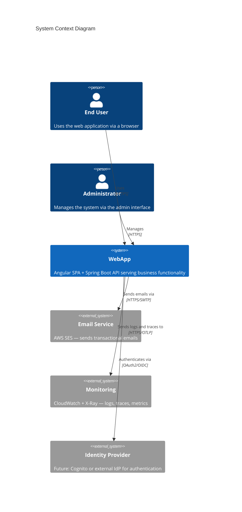
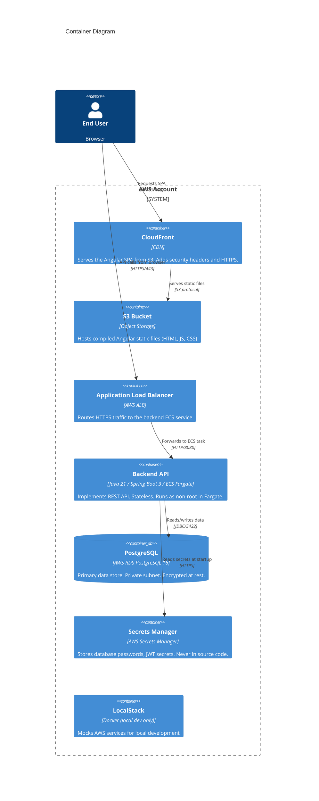

# Architecture Documentation

## C4 Level 1 — System Context



## C4 Level 2 — Container Diagram



## Data Flow

### Request Lifecycle (Happy Path)

```
Browser → CloudFront → S3 (static files)
Browser → CloudFront/ALB → ECS Backend
ECS Backend → Secrets Manager (startup only, cached)
ECS Backend → RDS PostgreSQL
ECS Backend → CloudWatch Logs (structured JSON)
ECS Backend → X-Ray (distributed traces)
```

### Authentication Flow (to be implemented)

```
Browser → Backend /api/v1/auth/login
Backend validates credentials
Backend returns JWT
Browser stores JWT in memory (not localStorage)
Browser sends JWT in Authorization: Bearer header on all API calls
Backend validates JWT on each request (stateless)
```

## Security Boundaries

| Boundary | What crosses it | How secured |
|----------|----------------|-------------|
| Internet → CloudFront | SPA assets, API calls | HTTPS only, CloudFront WAF (optional) |
| Internet → ALB | API calls | HTTPS only, Security Group restricts to 443 |
| ALB → ECS | API forwarding | HTTP (private VPC), Security Group restricts to ALB SG |
| ECS → RDS | Database queries | JDBC/TLS, Security Group restricts to ECS SG, Private subnet |
| ECS → Secrets Manager | Secret retrieval | HTTPS, IAM least-privilege task role |

## Module Structure (Backend)

```
backend/
├── domain/     ← Pure Java. No framework deps. Business rules live here.
│               ← Inward-facing: knows nothing about the outside world.
├── api/        ← OpenAPI spec + generated interfaces.
│               ← The contract. Neither domain nor app directly.
└── app/        ← Spring Boot wiring. Implements api/ interfaces.
                ← Knows about domain/ and api/. Never the other way.
```

This follows **Hexagonal Architecture (Ports and Adapters)**:
- Domain = core (no dependencies)
- API = port (interface definition)
- App = adapter (Spring Boot implementation)

## Key Technical Decisions

See `/docs/adr/` for all Architecture Decision Records:

| ADR | Topic |
|-----|-------|
| [0001](adr/0001-technology-stack.md) | Technology stack selection |
| [0002](adr/0002-contract-first-api-design.md) | Contract-first API with OpenAPI |
| [0003](adr/0003-test-strategy.md) | Three-layer test pyramid |
| [0004](adr/0004-accessibility-strategy.md) | WCAG 2.1 AA accessibility enforcement |
